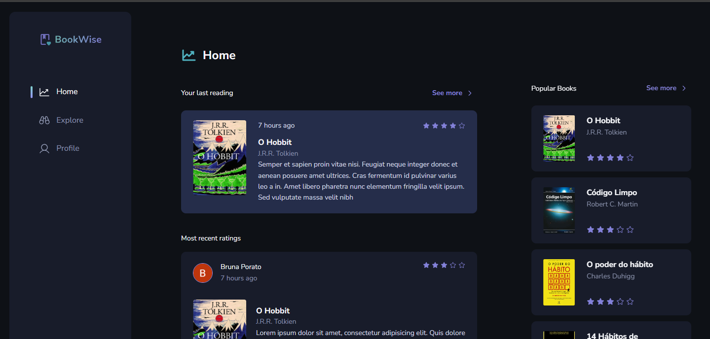

# BookWise



## About the Project

BookWise is a full-stack web application built end-to-end by one developer <small>(me 🐼)</small>, serving as a literary social network. It enables users to engage with books, share reviews, and discover new reads within a vibrant community. The application offers a seamless user experience with features including personalized recommendations, user profiles, and a comprehensive exploration interface.

### Features
- <strong>Book Discovery</strong>: Users can explore a vast collection of books categorized by genre or through a search function.
- <strong>Popular Recommendations</strong>: The home page provides users with book recommendations based on the community last reviews.
- <strong>User Profiles</strong>: Each user has a profile where they can track their reading progress, view their review history, and connect with other users.
- <strong>Community Engagement</strong>: The application fosters a sense of community by showcasing recent reviews, popular books, and trending topics on the home page.

### Techs Used
- Nextjs 13
- TypeScript
- Prisma
- PostgreSQL
- Stitches
- Zod
- + more: check the code to find out 😁

## Accessing the project

You can both use the project local or online.

1. Online:
- Check the project [clicking here](https://igt-bookwise-seven.vercel.app/)

2. Local:
- clone this repository
```bash
  git clone https://github.com/brunaporato/igt-bookwise.git
```

- install dependencies
```bash
  npm install
```

- set up your postgreSQL database and update the .env keys
```bash
  # PostgreSQL Keys
  POSTGRES_PRISMA_URL=
  POSTGRES_URL_NON_POOLING=

  # Google oAuth
  GOOGLE_CLIENT_ID=
  GOOGLE_CLIENT_SECRET=

  # Github oAuth
  GITHUB_ID=
  GITHUB_SECRET=

  # Next Secret
  NEXTAUTH_SECRET=
```

- run database migrations
```bash
npx prisma migrate dev
```

- start the project
```bash
npm run dev
```

## Usage
Upon opening the app, you'll encounter the login screen, where you have the option to sign in using your GitHub or Google account. If you prefer not to sign in, you're welcome to enter as a guest.
<br />
<small>Note: Guest users have limited access to features.</small>

After logging in, you'll be directed to the home page where you can explore recent reviews and popular books. Dive deeper into the Explore section to browse books by genre or utilize the search function to find specific titles. Click on any book to access comprehensive details, post your review, and interact with other users' reviews. Explore user profiles to track reading progress, review history, and connect with fellow book enthusiasts.

## Get in touch

Contributions are welcome, feel free to fork and create a pull request with your changes or open an issue if you've found something. If you want to talk further about this project or future ones you can find me on:
. [Linkedin](https://linkedin.com/in/brunaporato)
. [Email](mailto:brunaporato@gmail.com)